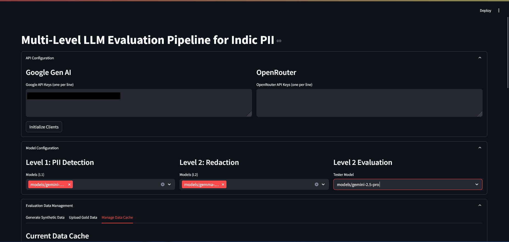
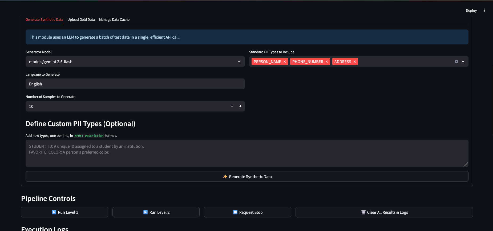
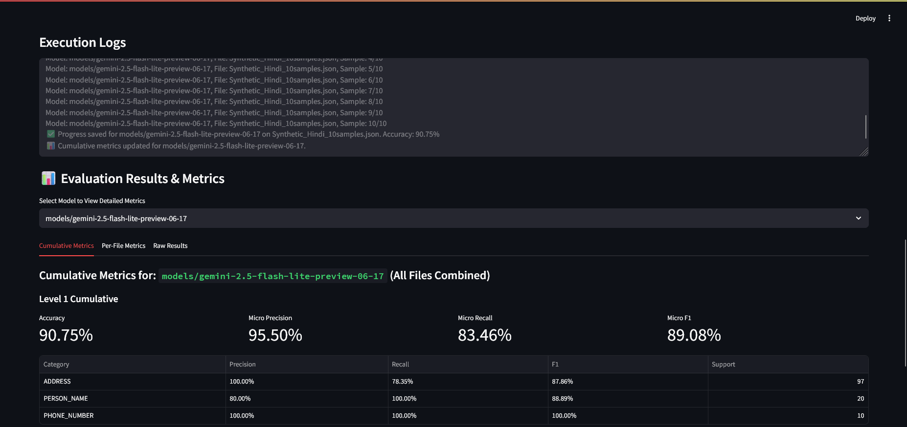

# LLM-PII-Eval-ToolKit
## GUI-Based-Benchmarker-for-LLM-Performance-as-PII-Redactor
[](https://streamlit.io)

An interactive web application built with Streamlit to evaluate, compare, and test Large Language Models (LLMs) on Personally Identifiable Information (PII) detection and redaction tasks, with a focus on Indic languages.

This tool provides a complete, multi-level pipeline to measure model performance and even generate its own synthetic test data on the fly.

---

## Overview

Here's a glimpse of the application's main interface:



---

## Key Features

-   **Multi-Level Evaluation:**
    -   **Level 1 (Detection):** Assesses a model's ability to identify and classify PII tokens within a text, providing detailed metrics like Precision, Recall, and F1-score for each PII category.
    -   **Level 2 (Redaction):** Tests a model's ability to perform contextual redaction of identified PII, evaluated by a separate "tester" LLM for accuracy.

-   **Multi-Provider & Model Support:**
    -   Integrates with both **Google (Gemini)** and **OpenRouter** APIs.
    -   Dynamically fetches and allows selection from all available models from connected providers.
    -   Handles API key rotation and rate limiting automatically.

-   **Synthetic Data Generation:**
    -   Don't have a dataset? **Generate one!**
    -   Uses a selected LLM to create high-quality, structured PII data in any specified language.
    -   Supports batch generation for efficiency and allows the inclusion of **custom, user-defined PII types**.
    -   Screenshot of the data generation interface:
        

-   **Detailed Metrics & Analysis:**
    -   Calculates and displays both per-file and cumulative metrics for each model.
    -   Provides raw JSON outputs for granular inspection.
    -   Allows for easy export of all calculated metrics in JSON format.
    -   Screenshot of the metrics display:
        

-   **Interactive & User-Friendly UI:**
    -   Manage API keys, select models, and upload or generate data through a clean web interface.
    -   View real-time logs of the evaluation process.
    -   Stop long-running processes gracefully.

## Getting Started

Follow these instructions to set up and run the project locally.

### Prerequisites

-   Python 3.8+
-   `pip` package manager

### Installation

1.  **Clone the repository:**
    ```bash
    git clone https://github.com/your-username/pii-evaluation-pipeline.git
    cd pii-evaluation-pipeline
    ```

2.  **Create and activate a virtual environment (recommended):**

    *On macOS / Linux:*
    ```bash
    python3 -m venv venv
    source venv/bin/activate
    ```
    *On Windows:*
    ```bash
    python -m venv venv
    .\venv\Scripts\activate
    ```

3.  **Install the required packages:**
    ```bash
    pip install -r requirements.txt
    ```

4.  **Run the Streamlit application:**
    ```bash
    streamlit run app.py
    ```
    Your web browser should automatically open to the application's URL.

## How to Use

1.  **Configure API Keys:** Open the "API Configuration" section and enter your API keys for Google and/or OpenRouter. Click "Initialize Clients".

2.  **Configure Models:** In the "Model Configuration" section, select the models you want to test for Level 1 (Detection) and Level 2 (Redaction). Also, select a powerful model to act as the "Tester Model" for evaluating L2 redaction quality.

3.  **Manage Data:**
    -   **Generate Data:** Go to the "Generate Synthetic Data" tab, choose a generator model, specify a language, select the PII types you want, and click "Generate". You can even define new, custom PII types.
    -   **Upload Data:** Alternatively, go to the "Upload Gold Data" tab to upload your own JSON evaluation files. The required format is a dictionary where each key is a sample ID and the value is an object containing `text`, `tokens`, and `labels`.
    -   **Manage Cache:** The "Manage Data Cache" tab allows you to see all loaded/generated data and download the synthetic datasets you created.

4.  **Run the Pipeline:**
    -   Click **"▶️ Run Level 1"** to start the PII detection evaluation.
    -   After Level 1 is complete, click **"▶️ Run Level 2"** to start the redaction evaluation.
    -   You can monitor progress in the "Execution Logs" section.

5.  **Analyze & Export Results:**
    -   Once a run is complete, the "Evaluation Results & Metrics" section will appear.
    -   Use the dropdown to select a model and view its performance metrics, broken down by file and category.
    -   You can view the raw JSON outputs in the "Raw Results" tab.
    -   Use the "Export Metrics" section to download a complete JSON report for a selected model.

## Contributing

Contributions are welcome! If you have suggestions for improvements or find a bug, please feel free to open an issue or submit a pull request.

## License

This project is licensed under the MIT License. See the `LICENSE` file for details.
